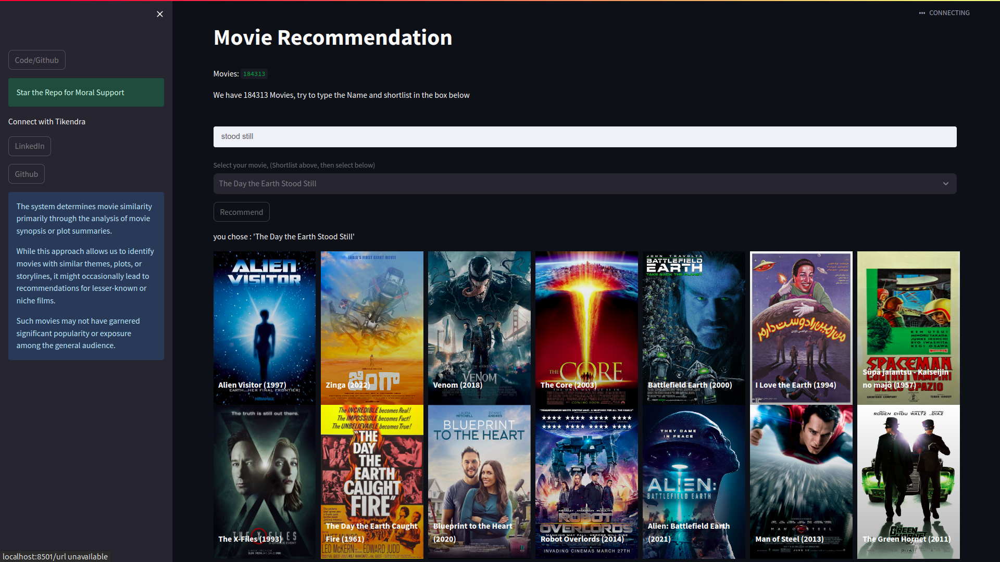

# Content-Based Movie Recommender System
Movie Recommender

## Table of Contents
* Introduction
* Requirements
* Installation
* Usage
* How it Works
* Note

## Introduction
The Content-Based Movie Recommender System is an application that suggests movies to users based on the similarity of movie content and synopsis    . It utilizes machine learning techniques to analyze movie attributes such as genre, director, actors, and plot summaries to generate personalized movie recommendations. This system helps users discover new movies that align with their preferences and interests.

## Requirements
To run the Content-Based Movie Recommender System, you need the following dependencies:

* Python 3.6+
* Steamlit
* scikit-learn library
* Polars library(for Data Manipulation)
* Movie dataset(IMDb) more the 280k Movies [dataset here](https://www.kaggle.com/datasets/moon114/imdb-all-movies-dataset)

## Installation

Clone this repository to your local machine.

```
git clone https://github.com/your_username/content-based-movie-recommender.git
cd content-based-movie-recommender
```

Install the required dependencies using pip.

```
pip install -r requirements.txt
```

Usage
Start the Streamlit web server.
```
streamlit run app.py
```

## How to Use
* Enter a movie preferences in white box.(Enter keywords that movie contains)
* Select from DropDown.
* Click on the "Search" button, and the system will provide a list of movie suggestions that match your preferences.
* **Checkout the App** [click here](https://huggingface.co/spaces/tikendraw/movie-recommender)

* Or Scan the code.

    

## How it Works

The Content-Based Movie Recommender System utilizes machine learning algorithms to identify the similarities between movies. 

It works in the following steps:

* **Data Collection:** The system gathers movie data from the provided dataset, including information such as genre, director, actors, and plot summaries.
* **Feature Extraction:** The system processes and converts the textual data into numerical features using natural language processing techniques.
* **Similarity Calculation:** It calculates the similarity between movies based on their numerical feature vectors. **Cosine similarity** or other distance metrics can be used for this purpose.
* **User Preference Input:** Users input their movie preferences through the web interface.
* **Recommendation Generation:** The system matches the user's preferences with the features of the movies and selects the most similar ones to provide as recommendations.
* **Display Recommendations:** The top recommended movies are displayed to the user on the web interface.

## Note
Our Content-Based Movie Recommender System relies on a vast dataset containing information on a wide array of movies. The large dataset allows us to provide more diverse and personalized movie suggestions to our users based on their preferences. However, due to the sheer size of the dataset and the unique nature of content-based recommendation, it is possible that some movie suggestions may appear unfamiliar or relatively unknown to users.

The system determines movie similarity primarily through the analysis of movie synopses or plot summaries. While this approach allows us to identify movies with similar themes, plots, or storylines, it might occasionally lead to recommendations for lesser-known or niche films. Such movies may not have garnered significant popularity or exposure among the general audience.

It is essential to understand that content-based recommendation focuses on matching the content attributes of movies, rather than considering popularity or social trends. Therefore, the recommendations are solely based on the textual characteristics and thematic elements shared between movies.
